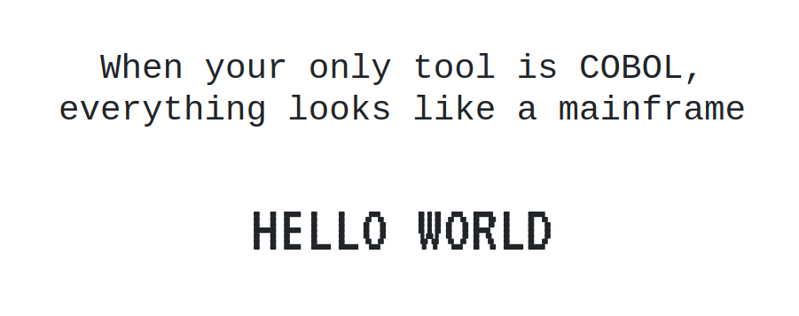

# When your only tool is COBOL

### Uses GnuCOBOL
```https://gnucobol.sourceforge.io/```

### Install GnuCOBOL 
#### (on Linux anyway)
```sudo apt install gnucobol```  

### To compile
```cobc -x hammer.cob```  

### To run
````./hammer````  
Output will be in `hammer.html`

  
